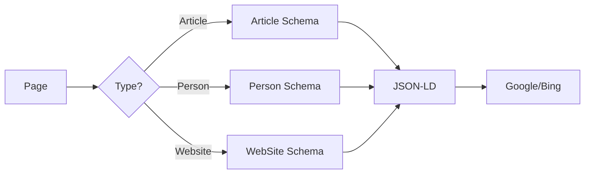

Almost two years after migrating to Astro, I find myself writing yet another article about the technical evolution of this blog. This time, the topic is different: I didn't change frameworks, but I caught up on all the accumulated technical debt in just a few days thanks to [Claude](https://claude.ai).

## The context

Since "Hello world 2.0", this blog was in a... let's say "functional" state. The build passed, the site displayed, but under the hood it was less glorious:

- ESLint was configured with the old syntax (`.eslintrc`) and wasn't linting `.astro` files
- Dependencies hadn't been updated in months
- OpenGraph image generation used a hacky method that no longer worked properly
- No structured data for SEO

In short, the kind of tedious tasks you postpone indefinitely.

## The evolution of generative AI

I had already tried using AI for development. In September 2025, I tested Codex to create a web project from scratch. The result was frustrating: the impression of covering 80% of the ground in seconds, then the impossibility of finishing the remaining 20%. The generated code looked almost correct at first glance, but on closer inspection, it was unusable. Trying to take over after an AI has produced something shaky is worse than writing everything yourself: you have to understand someone else's logic (in this case, no one's), and the errors are more subtle. I ended up throwing everything away.

With Claude Code in January 2026, the experience is radically different. Not only does the code work, but the tool is capable of:
- reading existing files to understand the context
- running commands to verify things work
- iterating on errors until resolution

Basically, it's like having a very fast junior developer who doesn't get offended when you ask them to start over.

## What was done

### Site redesign

I'm terrible at design. Really. I have vague ideas of what I want, but turning that into coherent CSS is beyond me. The old blog design was... functional, let's say.

Claude succeeded where I had been failing for years: translating my fuzzy requests ("I want something minimalist, modern, with good readability") into a clean design. The AI proposed a color palette, chose a typeface (Inter), structured the layouts, and iterated until I was happy with the result. All without me having to explain precisely what I wanted — because I didn't know myself.

### ESLint migration to flat config

Some people call me Sheldon. I can't keep coding if the lint isn't perfectly clean. A lingering warning, a misconfigured rule, and I'm stuck. I can't help it.


So the biggest piece was migrating ESLint to the new "flat config". The old configuration looked like this:

```json
// .eslintrc (old format)
{
  "extends": ["eslint:recommended"],
  "parserOptions": { "ecmaVersion": 2022 },
  "overrides": [{ "files": ["*.astro"], "parser": "astro-eslint-parser" }]
}
```

The new configuration in `eslint.config.mjs`:

```javascript
import eslint from '@eslint/js'
import tseslint from 'typescript-eslint'
import eslintPluginAstro from 'eslint-plugin-astro'

export default tseslint.config(
  eslint.configs.recommended,
  ...tseslint.configs.recommendedTypeChecked,
  ...eslintPluginAstro.configs.recommended,
  { languageOptions: { parserOptions: { projectService: true } } }
)
```

What's interesting is that Claude struggled with this problem. The `astro-eslint-parser` didn't support certain `typescript-eslint` options, and the error messages weren't very explicit. Watching the AI fumble around, try different configurations, read the documentation, then finally find the right combination was quite satisfying — especially since this is exactly the problem that blocked me almost two years ago and made me leave everything unfinished.

### OpenGraph image migration

OpenGraph images are what appears when you share a link on Twitter, LinkedIn, Slack, or iMessage. Without them, you get a sad, bare link. With them, you get a nice card with title, description, and image that makes people want to click.

The old method used Satori directly with a hack to copy the generated images. The new one uses [`astro-og-canvas`](https://github.com/delucis/astro-og-canvas) which handles everything natively:

```typescript
// src/pages/og/[...route].ts
import { OGImageRoute } from 'astro-og-canvas'
import { getCollection } from 'astro:content'

const blogEntries = await getCollection('blog')

export const { getStaticPaths, GET } = OGImageRoute({
  param: 'route',
  pages: Object.fromEntries(
    blogEntries.map(entry => [
      `blog-${entry.id}`,
      { title: entry.data.title, description: entry.data.description }
    ])
  ),
  getImageOptions: () => ({ font: { title: { families: ['Inter'] } } })
})
```

### SEO and structured data

JSON-LD (JavaScript Object Notation for Linked Data) is a way to tell Google and other search engines: "Here's exactly what this page is." Instead of letting bots guess, you give them structured metadata: "This is an article, written by this person, published on this date." Result: better search results, sometimes with "rich snippets" (those enhanced cards you see in Google results).

Added JSON-LD for search engines:



The Article schema for example:

```typescript
const articleSchema = {
  '@context': 'https://schema.org',
  '@type': 'Article',
  headline: title,
  datePublished: date.toISOString(),
  dateModified: (updatedDate ?? date).toISOString(),
  author: { '@type': 'Person', name: 'Timothée Rebours' }
}
```

### Breadcrumbs

Breadcrumbs are that little "Home > Blog > Article" navigation you see at the top of pages. It helps visitors orient themselves and navigate, but more importantly, it helps Google understand the site structure. With the `BreadcrumbList` schema, search engines can even display this path directly in search results.

Added breadcrumb navigation on articles:

```astro
<nav aria-label="Breadcrumb">
  <ol class="flex items-center gap-2 text-sm">
    <li><a href={translatePath('/')}>Home</a></li>
    <li><span class="text-zinc-400">/</span></li>
    <li><a href={translatePath('/blog')}>Blog</a></li>
    <li><span class="text-zinc-400">/</span></li>
    <li class="text-zinc-500">{title}</li>
  </ol>
</nav>
```

## Takeaway

In a few work sessions with Claude, I caught up on about two years of technical debt. The tasks that used to put me off (ESLint configuration, SEO, dependency updates) were handled almost automatically.

Will AI replace developers? Not yet. But it fundamentally changes the nature of the work: less time spent on plumbing, more time to think about what you want to build.
