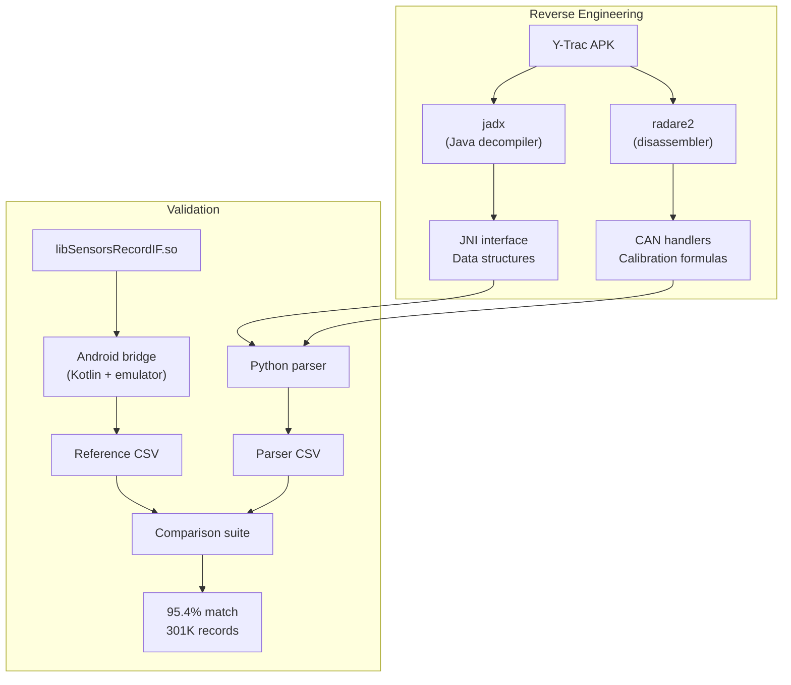

I'm not a motorcyclist. A friend told me he had tried to extract data from his Yamaha Y-Trac telemetry files without success. I said it would be easy with Claude. It became a matter of principle.

The truth is: it took 23% of my weekly Claude Max quota, but I got it done in 48 hours.

## What is Y-Trac?

The Yamaha Y-Trac system is a data logger (CCU — Communication Control Unit) installed on some Yamaha motorcycles. It records telemetry at 10 Hz into proprietary `.CTRK` binary files:

- **GPS**: latitude, longitude, speed (from NMEA sentences)
- **CAN bus**: engine RPM, gear, throttle position, brake pressure, wheel speed, lean angle, pitch, acceleration, temperature, fuel consumption
- **Electronics**: ABS, traction control, slide control, launch control states
- **Lap timing**: finish line crossing detection

The official Y-Trac Android app can display this data, but there's no export functionality. The data is locked in a proprietary format, processed by a native C library (`libSensorsRecordIF.so`) that ships with the APK.

## The reverse-engineering journey

### Step 1: Extract the native library

The first step was to get the native library out of the APK. An APK is just a ZIP file:

```bash
unzip com.yamaha.jp.dataviewer-v1.3.8.apk -d ytrac_apk
```

Inside `lib/`, there are builds for multiple architectures. The `x86_64` version is the most useful for disassembly since radare2 has better support for x86 than ARM.

### Step 2: Decompile the Java layer with jadx

[jadx](https://github.com/skylot/jadx) decompiles Android DEX bytecode back to readable Java. This revealed the JNI interface — the bridge between the Java app and the native C library:

```java
// Key JNI methods from SensorsRecordIF.java
int GetSensorsRecordData(
    String fileName,       // Path to CTRK file
    int fileType,          // 0=CTRK, 1=TRG
    int lapIndex,          // 0-based lap index
    SensorsRecord[] output,// Pre-allocated array
    int maxRecords,        // Max records (72000)
    int[] actualCount,     // Records actually written
    AINInfo ainInfo         // Auxiliary input metadata
);
```

The `SensorsRecord` class revealed the complete data structure — 21 telemetry fields, each with its Java type and field name, giving us the expected output format.

### Step 3: Disassemble with radare2

[radare2](https://rada.re) is a reverse-engineering framework. It can disassemble native libraries and let you trace the execution flow. This is where the real detective work happened.

The key function `GetSensorsRecordData` at address `0xa970` contains the main parsing loop. By tracing its execution, we could identify:

1. **The file structure**: a header starting with `"HEAD"` magic bytes, followed by typed data records, ending with `"END."`
2. **Record types**: type 1 (GPS NMEA), type 3 (CAN bus), type 4 (timestamp), type 5 (lap marker)
3. **8 CAN message handlers**, each decoding specific telemetry channels from 8-byte CAN payloads

For example, CAN ID `0x0209` decodes RPM and gear:

```
Address 0xe0f2:  RPM = (byte[0] << 8 | byte[1]) / 2.56
Address 0xe131:  Gear = byte[4] & 0x0F
                 if (Gear == 7) Gear = previous_gear  // reject invalid
```

Each CAN handler was traced to extract the exact byte positions, bit masks, and calibration formulas. In total, 8 CAN IDs decode 21 telemetry channels:

| CAN ID | Channels |
|--------|----------|
| `0x0209` | RPM, Gear |
| `0x0215` | Throttle (TPS/APS), TCS, SCS, LIF, Launch |
| `0x023E` | Water temp, Intake temp, Fuel |
| `0x0250` | Acceleration X, Acceleration Y |
| `0x0258` | Lean angle, Pitch rate |
| `0x0260` | Front brake, Rear brake |
| `0x0264` | Front wheel speed, Rear wheel speed |
| `0x0268` | Front ABS, Rear ABS |

### Step 4: Build the Python parser

With all the formulas extracted, I built a Python parser (1031 lines) that reads `.CTRK` files and outputs calibrated CSV data. The parser:

1. Validates the `"HEAD"` magic bytes
2. Extracts finish line coordinates from the header
3. Iterates through data records, maintaining CAN channel state
4. Emits a telemetry record every 100ms (10 Hz)
5. Detects laps by checking if GPS positions cross the finish line

### Step 5: Validate against the native library

This is the part that took the most effort. To validate the parser, I needed reference output from the native library. The problem: the native library only runs on Android.

The solution was to build a Kotlin Android app that:
1. Loads the native `.so` via JNI
2. Calls `GetSensorsRecordData` for each lap
3. Exports the results as CSV

Running this through an Android emulator on macOS, I generated reference output for 47 CTRK files.

Then I built a comparison suite that aligns records by GPS position (since timestamps differ slightly between parsers) and compares each of the 22 channels with appropriate tolerances.

**Results**: 95.4% overall match rate across 301,166 records and 6.6 million individual comparisons. 3 channels achieved a perfect 100% match. The remaining differences are mostly due to architectural choices (continuous vs per-lap processing) rather than formula errors.



## The TypeScript rewrite

Once the Python parser was validated, the next step was to make it accessible to everyone — in the browser, no installation required.

The TypeScript version (`@tex0l/ctrk-parser`) is a zero-dependency, platform-agnostic rewrite that runs in both Node.js and the browser. It achieves 100% match with the Python reference implementation.

On top of the parser, I built an Astro integration (`@tex0l/ctrk-astro`) with Vue.js components:

- **FileUpload**: drag-and-drop with file validation (checks the `"HEAD"` magic bytes) and Web Worker parsing to keep the UI responsive
- **TrackMap**: Leaflet map with color-coded lap polylines
- **TelemetryChart**: Chart.js graphs for all 21 channels with [LTTB downsampling](https://skemman.is/handle/1946/15343) (5000 points max)
- **LapTimingTable**: lap times with delta to best lap and CSV export

The Web Worker approach is key: parsing a large CTRK file (8 MB, ~20,000 records) takes a few seconds. Without the worker, this would freeze the browser tab. With it, the UI stays fully responsive while parsing happens in a background thread.

## Try it

You can try it right now on [the CTRK Exporter page](/en/ctrk-exporter). Drop a `.CTRK` file and explore the data — everything runs locally in your browser, no data is sent anywhere.

The source code is available on [GitHub](https://github.com/tex0l/ctrk-exporter). The packages are published on npm:

```bash
npm install @tex0l/ctrk-parser   # Parser only
npm install @tex0l/ctrk-astro    # Astro integration
npm install @tex0l/ctrk-cli      # CLI tool
```

## Takeaway

This project was a good test of Claude's capabilities on a real reverse-engineering task. The AI handled the tedious parts (tracing disassembly, building comparison frameworks, writing boilerplate) while I focused on the interesting decisions (parser architecture, validation strategy, what to optimize).

The one thing that surprised me most: Claude's ability to read radare2 disassembly output and extract the correct byte positions and calibration formulas. Reverse-engineering is usually a slow, manual process. Having an AI that can process pages of assembly and propose "CAN byte[2] at offset 0xe0f2 is RPM with formula `raw / 2.56`" is genuinely useful.

Cover photo by [cnrdmroglu](https://www.pexels.com/photo/man-riding-motorcycle-on-a-racing-track-18428157/) on Pexels.
