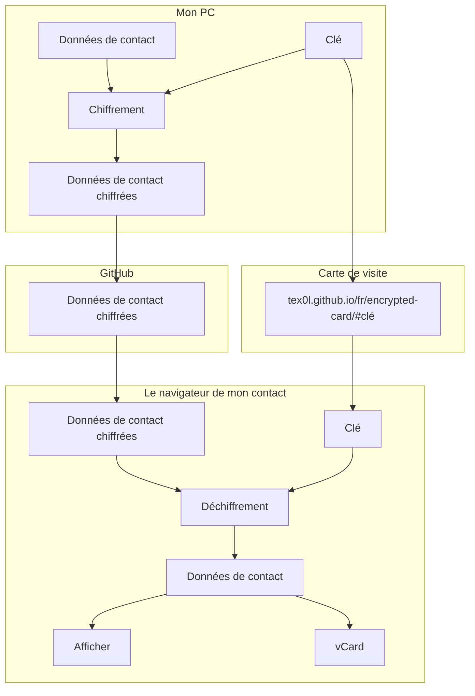

import { Icon } from "astro-icon/components"

Vous avez peut-être déjà vu ces cartes de visite réutilisables que l'on ne distribue pas, mais que l'on fait scanner (par QRCode ou NFC), et qui permettent de télécharger directement la fiche contact (comme [MyEverCard](https://myevercard.com/)).

Usuellement, ces cartes contiennent simplement un lien vers un site (payant), et le détenteur peut actualiser ses coordonnées sur ce site. Le hic, c'est que ce site détient donc les coordonnées de tous ses utilisateurs en clair, et je n'ai pas envie de partager les miennes (ni de payer un abonnement).

L'objectif de cet article est de faire un équivalent de ce service, mais avec un lien qui pointe vers un site statique (le blog que vous lisez), sans pour autant que n'importe qui parcourant ce site ne puisse y avoir accès.

TLDR: j'explique comment j'ai codé une carte de visite chiffrée <Icon name="noto:man-shrugging" class="inline w-6"/>.

## Comment ça marche ?
Le principe est le suivant :
1. chiffrer les données de contact confidentielles localement avec une clé secrète.
2. stocker les données chiffrées sur un serveur statique (comme Github Pages).
3. produire un lien permettant d'accéder au serveur statique et qui contient la clé secrète dans le hash d'URL.
4. récupérer et déchiffrer côté client ces données depuis le navigateur de la personne ouvrant le lien.
5. afficher les données de contact et permettre de télécharger la fiche du contact.


D'ailleurs, j'ai littéralement créé mon entreprise [Seald](https://www.seald.io) autour de l'idée du chiffrement côté client dans des applications web et mobile.

## Limites connues
La donnée plus sensible que je veux protéger avec ce projet est mon numéro de téléphone, qui est certainement déjà accessible en ligne publiquement vu le nombre d'appels de prospection que je reçois, je ne cherche donc pas à remplir de véritables objectifs de sécurité.

En particulier, les attaques que j'ignore volontairement sont :
1. GitHub injectant du code dans le site statique qui pourrait alors exfiltrer les données une fois chiffrées.
2. La connexion avec GitHub qui pourrait être compromise pour permettre d'altérer le code du site statique.
3. L'ordinateur ou le navigateur de mon contact qui serait compromis, ce qui compromettrait les données de contact et la clé secrète.
4. Un contact qui partagerait le lien ou la clé secrète volontairement ou non.

## Chiffrement
Tout d'abord, il faut chiffrer les données sur mon PC : `contactInfo.json` et `profilePicture.jpg` qui sont placés dans le dossier `publicToEncrypt` du projet (qui est dans le `.gitignore` pour éviter de le publier en clair dans le dépôt de code)

Pour cela, je dois :
- [dériver une clé à partir d'un mot de passe](#deriver-le-mot-de-passe).
- [chiffrer chaque fichier avec cette clé](#chiffrer-un-fichier).
- ajouter les fichiers chiffrés au dépôt de code pour qu'ils soient accessibles depuis le chemin `/encrypted/{nom_de_fichier}.encrypted`.

### Dériver le mot de passe
Manipuler 32 bytes aléatoires encodés en base64 dans une URL n'étant pas pratique, j'ai préféré passer par un mot de passe.

Pour dériver une clé de 32 bytes à partir de ce mot de passe, j'utilise la fonction de dérivation `scrypt` et un sel aléatoire accessible statiquement dans un fichier [`/salt.txt`](/salt.txt).

```typescript
import { scrypt } from 'node:crypto'
import { promisify } from 'node:util'
import { readFile } from 'node:fs/promises'
import { Buffer } from 'node:buffer'

const scryptAsync = promisify(scrypt)
const N = 1024, r = 8, p = 1
const dkLen = 32

const normalizePassword = (password: string): Buffer => Buffer.from(password.normalize('NFKC'), 'utf8')

const deriveKey = async (password: Buffer, salt: Buffer): Promise<Buffer> => scryptAsync(password, salt, dkLen, { N, r, p })

const salt = Buffer.from(await readFile('./public/salt.txt'), 'base64')
const password = normalizePassword(process.env.PASSWORD)
const key = await deriveKey(password, salt)
```

### Chiffrer un fichier
Pour chiffrer un fichier avec une clé `key` donnée, j'utilise AES-GCM et un nonce aléatoire de 12 bytes :

```typescript
import type { Cipher } from 'node:crypto'
import type { Buffer } from 'node:buffer'
import { createCipheriv, randomBytes } from 'node:crypto'

// Cette fonction est appelée par `encryptDir` pour chaque fichier à chiffrer
const encryptFile = async (data: Buffer, key: Buffer): Buffer => {
  const nonce: Buffer = randomBytes(12)
  const cipher: Cipher  = createCipheriv('aes-256-gcm', key, nonce)
  const encryptedData: Buffer = Buffer.concat([cipher.update(data), cipher.final()])

  const authTag: Buffer = cipher.getAuthTag()

  return Buffer.concat([nonce, encryptedData, authTag])
}
```

:::note
Le mode GCM retenu pour AES requiert :
- que le nonce ne soit pas aléatoire, mais "unique", et aléatoire n'est pas considéré comme unique en cryptographie (voir [l'article que j'ai rédigé sur le blog de Seald](https://www.seald.io/fr/blog/3-erreurs-courantes-quand-on-implemente-du-chiffrement#g%C3%A9n%C3%A9ration-des-iv))
- que le message ne dépasse pas 64Go, sinon cela dépasse le compteur utilisé par AES-CTR (utilisé en interne par AES-GCM).

Dans mon cas :
- je tolère que le nonce soit aléatoire dans la mesure où le nombre de chiffrés est très faible, bien en deça des 6 milliards au-delà desquels le nonce ne serait plus "unique".
- je ne chiffre pas de fichier de plus de 64Go.
:::

Après avoir exécuté cette fonction sur `profilePicture.jpg` et `contactInfo.json` (non publiés sur le dépôt de code), deux fichiers chiffrés sont produits et ajoutés au dépôt de code : `profilePicture.jpg.encrypted` et `contactInfo.json.encrypted`.

## Partage du mot de passe
Pour partager le mot de passe, j'utilise le [hash d'URL](https://developer.mozilla.org/en-US/docs/Web/API/URL/hash) qui est ce qui est situé après le `#` dans une URL. Normalement, celui-ci est utilisé pour défiler automatiquement jusqu'à une ancre dans la page. Mais le hash d'URL a la propriété de ne pas être transmis dans la requête réseau, cela reste exclusivement dans le contexte Javascript de la page.

Il est donc possible d'utiliser ce hash d'URL pour transférer un secret dans une URL au contexte Javascript sans que le serveur qui héberge n'y ait jamais accès.

> https://tex0l.github.io/fr/encrypted-card-dummy/#my-super-secret-password

Une fois que la page est ouverte, on peut récupérer ce mot de passe dans la page de la façon suivante :

```typescript
const password = window.location.hash.substring(1) // le premier caractère étant `#`
```

## Déchiffrement
Pour déchiffrer, cela s'opère en deux temps :
- dériver le mot de passe en la clé.
- déchiffrer les fichiers avec la clé.

### Dériver le mot de passe (bis)
Pour dériver le mot de passe dans le navigateur, on procède de la même façon que dans notre script initial, au détail près que la bibliothèque standard de Node.js n'est pas disponible.

On utilise donc la bibliothèque [`scrypt-js`](https://github.com/ricmoo/scrypt-js) pour effectuer la dérivation, [`buffer`](https://github.com/feross/buffer) pour avoir un polyfill de `Buffer` dans le navigateur, et on importe la clé résultante en tant que `CryptoKey` de [SubtleCrypto](https://developer.mozilla.org/en-US/docs/Web/API/SubtleCrypto) :

```typescript
import { Buffer } from 'buffer'
import { scrypt } from 'scrypt-js'

const normalizePassword = (password: string): Buffer => Buffer.from(password.normalize('NFKC'), 'utf8')

const N = 1024, r = 8, p = 1
const dkLen = 32

const deriveKey = async (password:string, salt:Buffer): Promise<CryptoKey> =>
  self.crypto.subtle.importKey(
    'raw',
    await scrypt(normalizePassword(password), salt, N, r, p, dkLen),
    { name: 'AES-GCM' },
    false,
    ['decrypt']
  )

const salt = await (await window.fetch('/salt.txt')).text() // le sel est disponible publiquement

const key = await deriveKey(password, Buffer.from(salt, 'base64'))
```

### Déchiffrer un fichier
On poursuit l'opération en déchiffrant `encryptedContactInfo.json.encrypted` et `profilePicture.jpg.encrypted`

```typescript
const decrypt = async (data: Uint8Array, key: CryptoKey): Promise<ArrayBuffer> => {
  const nonce = data.slice(0, 12)
  const ciphertext = data.slice(12)

  return self.crypto.subtle.decrypt(
    {
      name: 'AES-GCM',
      iv: nonce
    },
    key,
    ciphertext
  )
}

const encryptedContactInfo = await (await window.fetch('/encrypted/contactInfo.json.encrypted')).arrayBuffer()
const encryptedProfilePicture = await (await window.fetch('/encrypted/profilePicture.jpg.encrypted')).arrayBuffer()

const decryptedContactInfo = await decrypt(encryptedContactInfo, key)
const decryptedProfilePicture = await decrypt(encryptedProfilePicture, key)
```

Les versions brutes des données déchiffrées que l'on a sous forme de `Blob` sont utilisées de la façon suivante dans le contexte de la page :

```typescript
import { Buffer } from 'buffer'
const contactInfo = JSON.parse(Buffer.from(decryptedContactInfo).toString('utf-8'))
// {
//   "firstName": "John",
//   "lastName": "Doe",
//   "emailAddress": "john@doe.org",
//   "phoneNumber": "+1 234 567 890",
//   "linkedin": "jdoe",
//   "twitter": "@DoeJ",
//   "jobTitle": "Dummy job",
//   "companyName": "Dummy company",
//   "companyLink": "https://www.doe.org",
//   "emailAddressLink": "mailto:john@doe.org",
//   "phoneNumberLink": "tel:+1234567890",
//   "twitterLink": "https://twitter.com/DoeJ",
//   "linkedinLink": "https://www.linkedin.com/in/jdoe/",
//   "personalWebsiteLink": "https://www.doe.org"
// }

const blobURL = URL.createObjectURL(new Blob([decryptedProfilePicture]))
// blob:https://tex0l.github.io/95ef5165-ccb6-41c4-8157-5ec943509e46
```

### Téléchargement d'une fiche contact
Pour générer la fiche contact, j'utilise le paquet [`vcard-creator`](https://github.com/joaocarmo/vcard-creator), et je la génère à la volée au clic et déclenche le téléchargement programmatiquement :

```typescript
import vCard from 'vcard-creator'
const card = new vCard()
const text = card
    .addName(contactInfo.lastName, contactInfo.firstName)
    .addCompany(contactInfo.companyName)
    .addJobtitle(contactInfo.jobTitle)
    .addEmail(contactInfo.emailAddress)
    .addPhoneNumber(contactInfo.phoneNumber)
    .addSocial(contactInfo.twitterLink, 'Twitter', contactInfo.twitter)
    .addSocial(contactInfo.linkedinLink, 'LinkedIn', contactInfo.linkedin)
    .addURL(contactInfo.personalWebsiteLink)
    .addURL(contactInfo.companyLink)
    .addPhoto(Buffer.from(decryptedProfilePicture).toString('base64'), 'JPEG')
    .buildVCard()

const blob = new Blob([text], { type: 'text/vcard' })

const a = document.createElement('a')
a.download = `${contactInfo.firstName}-${contactInfo.lastName}.vcard`
a.href = URL.createObjectURL(blob)
a.dataset.downloadurl = ['text/vcard', a.download, a.href].join(':')
a.style.display = 'none'
document.body.appendChild(a)
a.click()
document.body.removeChild(a)
setTimeout(function () { URL.revokeObjectURL(a.href) }, 1500)
```

Pour le reste, la tuyauterie est faite en Vue.js par facilité, mais cela n'a aucune importance. Si vous voulez jeter un œil au code source, il diffère légèrement des snippets ci-dessus que j'ai simplifiés.

## Conclusion
Je ne peux pas vous donner le véritable mot de passe, cela serait stupide (vous pouvez tenter de le bruteforcer sur cette page [`https://tex0l.github.io/fr/encrypted-card/`](/fr/encrypted-card/), si vous y arrivez, n'hésitez pas à me le dire <Icon name="noto:winking-face" class="inline w-6"/>).

En revanche, voici une version "dummy" que vous pouvez essayer : [https://tex0l.github.io/fr/encrypted-card-dummy/#my-super-secret-password](/fr/encrypted-card-dummy/#my-super-secret-password). Cette version "dummy" utilise :
- `my-super-secret-password` comme mot de passe.
- [`/saltDummy.txt`](/saltDummy.txt) comme sel.
- [`/encryptedDummy/contactInfo.json.encrypted`](/encryptedDummy/contactInfo.json.encrypted) pour les coordonnées chiffrées.
- [`/encryptedDummy/stock-portrait.png.encrypted`](/encryptedDummy/stock-portrait.png.encrypted) pour la photo chiffrée.

Maintenant, je dois commander des cartes de visite NFC pour rendre ce projet un tant soit peu utile...

Image by [Freepik](https://www.freepik.com/free-photo/hands-holding-blank-business-card_24488905.htm#query=business%20card&position=9&from_view=search&track=sph), Portrait Of Black Business Man Smiling In An Office With His Arms Crossed by Flamingo Images from NounProject.com
