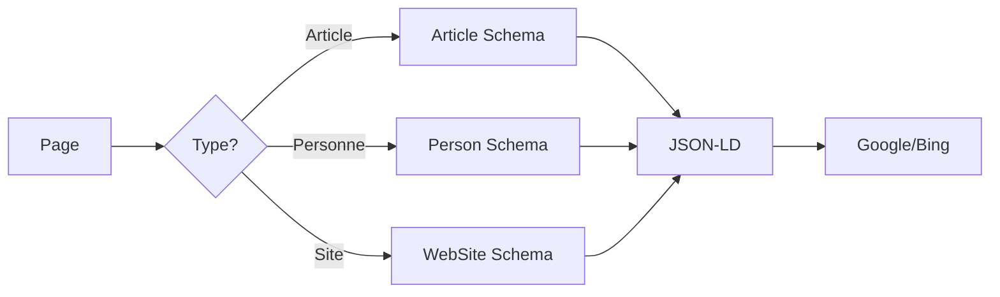

Presque deux ans après la migration vers Astro, je me retrouve à nouveau à écrire un article sur l'évolution technique de ce blog. Cette fois-ci, le sujet est différent : je n'ai pas changé de framework, mais j'ai rattrapé toute la dette technique accumulée en quelques jours grâce à [Claude](https://claude.ai).

## Le contexte

Depuis le "Hello world 2.0", ce blog était dans un état... disons "fonctionnel". Le build passait, le site s'affichait, mais sous le capot c'était moins glorieux :

- ESLint était configuré avec l'ancienne syntaxe (`.eslintrc`) et ne lintait pas les fichiers `.astro`
- Les dépendances n'avaient pas été mises à jour depuis des mois
- La génération d'images OpenGraph utilisait une méthode bricolée qui ne fonctionnait plus correctement
- Aucune donnée structurée pour le SEO

Bref, le genre de tâches ingrates qu'on repousse indéfiniment.

## L'évolution de l'IA générative

J'avais déjà essayé d'utiliser l'IA pour du développement. En septembre 2025, j'avais testé Codex pour créer un projet web from scratch. Le résultat était frustrant : l'impression de faire 80% du chemin en quelques secondes, puis l'impossibilité de terminer les 20% restants. Le code généré avait l'air presque correct au premier coup d'œil, mais en y regardant de plus près, c'était inutilisable. Essayer de reprendre la main après qu'une IA ait pondu quelque chose de bancal est pire que de tout écrire soi-même : il faut comprendre la logique de quelqu'un d'autre (en l'occurrence, personne), et les erreurs sont plus subtiles. J'ai fini par tout jeter.

Avec Claude Code en janvier 2026, l'expérience est radicalement différente. Non seulement le code fonctionne, mais l'outil est capable de :
- lire les fichiers existants pour comprendre le contexte
- exécuter les commandes pour vérifier que ça marche
- itérer sur les erreurs jusqu'à résolution

En gros, c'est comme avoir un développeur junior très rapide qui ne se vexe pas quand on lui demande de recommencer.

## Ce qui a été fait

### Redesign du site

Je suis nul en design. Vraiment. J'ai des idées vagues de ce que je veux, mais transformer ça en CSS cohérent, c'est au-dessus de mes forces. L'ancien design du blog était... fonctionnel, disons.

Claude a réussi là où j'échouais depuis des années : traduire mes demandes floues ("je veux quelque chose de minimaliste, moderne, avec une bonne lisibilité") en un design propre. L'IA a proposé une palette de couleurs, choisi une typographie (Inter), structuré les layouts, et itéré jusqu'à ce que le résultat me convienne. Le tout sans que j'aie à expliquer précisément ce que je voulais — parce que je ne le savais pas moi-même.

### Migration ESLint vers flat config

Certains m'appellent Sheldon. Je ne peux pas continuer à coder si le lint n'est pas parfaitement carré. Un warning qui traîne, une règle mal configurée, et je suis bloqué. C'est plus fort que moi.


Le plus gros morceau était donc la migration d'ESLint vers la nouvelle "flat config". L'ancienne configuration ressemblait à ça :

```json
// .eslintrc (ancien format)
{
  "extends": ["eslint:recommended"],
  "parserOptions": { "ecmaVersion": 2022 },
  "overrides": [{ "files": ["*.astro"], "parser": "astro-eslint-parser" }]
}
```

La nouvelle configuration en `eslint.config.mjs` :

```javascript
import eslint from '@eslint/js'
import tseslint from 'typescript-eslint'
import eslintPluginAstro from 'eslint-plugin-astro'

export default tseslint.config(
  eslint.configs.recommended,
  ...tseslint.configs.recommendedTypeChecked,
  ...eslintPluginAstro.configs.recommended,
  { languageOptions: { parserOptions: { projectService: true } } }
)
```

Ce qui est intéressant, c'est que Claude a galéré sur ce problème. Le parser `astro-eslint-parser` ne supportait pas certaines options de `typescript-eslint`, et les messages d'erreur n'étaient pas très explicites. Observer l'IA tâtonner, essayer différentes configurations, lire la documentation, puis finalement trouver la bonne combinaison était assez satisfaisant — d'autant plus que c'est exactement ce problème qui m'avait bloqué il y a presque deux ans et qui m'avait fait tout laisser en plan.

### Migration des images OpenGraph

Les images OpenGraph, c'est ce qui s'affiche quand vous partagez un lien sur Twitter, LinkedIn, Slack ou iMessage. Sans ça, vous avez un lien triste et nu. Avec, vous avez une belle carte avec titre, description et image qui donne envie de cliquer.

L'ancienne méthode utilisait Satori directement avec un bricolage pour copier les images générées. La nouvelle utilise [`astro-og-canvas`](https://github.com/delucis/astro-og-canvas) qui gère tout nativement :

```typescript
// src/pages/og/[...route].ts
import { OGImageRoute } from 'astro-og-canvas'
import { getCollection } from 'astro:content'

const blogEntries = await getCollection('blog')

export const { getStaticPaths, GET } = OGImageRoute({
  param: 'route',
  pages: Object.fromEntries(
    blogEntries.map(entry => [
      `blog-${entry.id}`,
      { title: entry.data.title, description: entry.data.description }
    ])
  ),
  getImageOptions: () => ({ font: { title: { families: ['Inter'] } } })
})
```

### SEO et données structurées

JSON-LD (JavaScript Object Notation for Linked Data), c'est une façon de dire à Google et aux autres moteurs de recherche : "Voici exactement ce qu'est cette page". Au lieu de laisser les robots deviner, on leur donne des métadonnées structurées : "Ceci est un article, écrit par cette personne, publié à cette date". Résultat : de meilleurs résultats de recherche, avec parfois des "rich snippets" (ces encadrés enrichis qu'on voit dans les résultats Google).

Ajout de JSON-LD pour les moteurs de recherche :



Le schéma Article par exemple :

```typescript
const articleSchema = {
  '@context': 'https://schema.org',
  '@type': 'Article',
  headline: title,
  datePublished: date.toISOString(),
  dateModified: (updatedDate ?? date).toISOString(),
  author: { '@type': 'Person', name: 'Timothée Rebours' }
}
```

### Fil d'Ariane (Breadcrumbs)

Le fil d'Ariane, c'est cette petite navigation "Accueil > Blog > Article" qu'on voit en haut des pages. Ça aide les visiteurs à se repérer et à naviguer, mais surtout, ça aide Google à comprendre la structure du site. Avec le schéma `BreadcrumbList`, les moteurs de recherche peuvent même afficher ce chemin directement dans les résultats de recherche.

Ajout d'un fil d'Ariane sur les articles :

```astro
<nav aria-label="Breadcrumb">
  <ol class="flex items-center gap-2 text-sm">
    <li><a href={translatePath('/')}>Accueil</a></li>
    <li><span class="text-zinc-400">/</span></li>
    <li><a href={translatePath('/blog')}>Blog</a></li>
    <li><span class="text-zinc-400">/</span></li>
    <li class="text-zinc-500">{title}</li>
  </ol>
</nav>
```

## Bilan

En quelques sessions de travail avec Claude, j'ai rattrapé environ deux ans de dette technique. Les tâches qui me rebutaient (configuration ESLint, SEO, mise à jour des dépendances) ont été traitées de manière quasi-automatique.

Est-ce que l'IA va remplacer les développeurs ? Pour l'instant, non. Mais elle change fondamentalement la nature du travail : moins de temps passé sur la plomberie, plus de temps pour réfléchir à ce qu'on veut construire.
