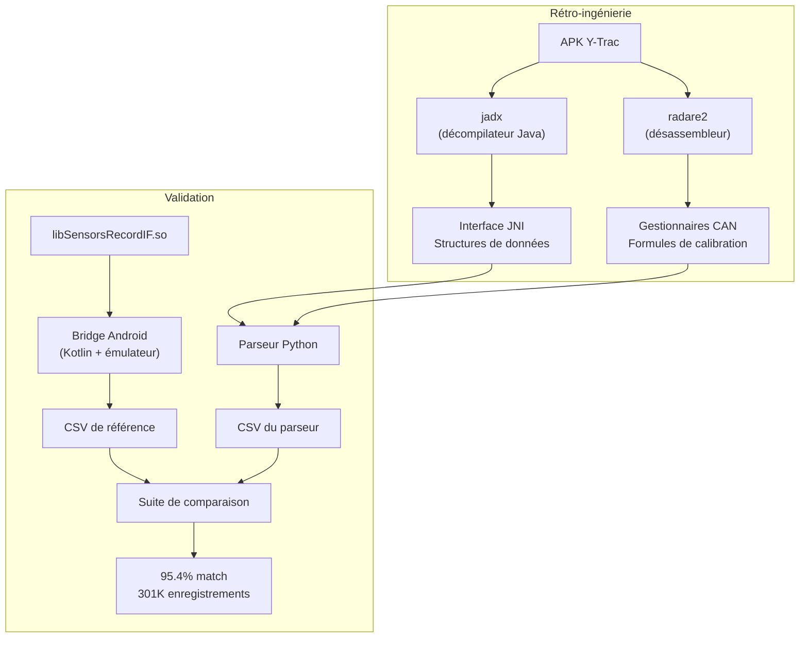

Je ne suis pas motard. Un ami m'a dit qu'il avait essayé d'extraire les données de ses fichiers de télémétrie Yamaha Y-Trac sans succès. J'ai dit que ce serait facile avec Claude. C'est devenu une question de principe.

La vérité : ça m'a coûté 23% de mon quota hebdomadaire Claude Max, mais j'ai réussi en 48 heures.

## Qu'est-ce que Y-Trac ?

Le système Yamaha Y-Trac est un enregistreur de données (CCU — Communication Control Unit) installé sur certaines motos Yamaha. Il enregistre la télémétrie à 10 Hz dans des fichiers binaires propriétaires `.CTRK` :

- **GPS** : latitude, longitude, vitesse (depuis des trames NMEA)
- **Bus CAN** : régime moteur, rapport de boîte, position de l'accélérateur, pression de frein, vitesse des roues, angle d'inclinaison, tangage, accélération, température, consommation
- **Électronique** : ABS, antipatinage, contrôle de glisse, launch control
- **Chronométrage** : détection de passage sur la ligne d'arrivée

L'application Android officielle Y-Trac peut afficher ces données, mais il n'y a aucune fonctionnalité d'export. Les données sont verrouillées dans un format propriétaire, traitées par une bibliothèque C native (`libSensorsRecordIF.so`) embarquée dans l'APK.

## Le parcours de rétro-ingénierie

### Étape 1 : Extraire la bibliothèque native

La première étape consistait à extraire la bibliothèque native de l'APK. Un APK est simplement un fichier ZIP :

```bash
unzip com.yamaha.jp.dataviewer-v1.3.8.apk -d ytrac_apk
```

Dans `lib/`, on trouve des builds pour plusieurs architectures. La version `x86_64` est la plus utile pour le désassemblage car radare2 a un meilleur support pour x86 que pour ARM.

### Étape 2 : Décompiler la couche Java avec jadx

[jadx](https://github.com/skylot/jadx) décompile le bytecode Android DEX en Java lisible. Cela a révélé l'interface JNI — le pont entre l'application Java et la bibliothèque C native :

```java
// Méthodes JNI clés depuis SensorsRecordIF.java
int GetSensorsRecordData(
    String fileName,       // Chemin vers le fichier CTRK
    int fileType,          // 0=CTRK, 1=TRG
    int lapIndex,          // Index du tour (base 0)
    SensorsRecord[] output,// Tableau pré-alloué
    int maxRecords,        // Max d'enregistrements (72000)
    int[] actualCount,     // Nombre réel écrit
    AINInfo ainInfo         // Métadonnées d'entrée auxiliaire
);
```

La classe `SensorsRecord` a révélé la structure de données complète — 21 champs de télémétrie, chacun avec son type Java et son nom, nous donnant le format de sortie attendu.

### Étape 3 : Désassembler avec radare2

[radare2](https://rada.re) est un framework de rétro-ingénierie. Il peut désassembler des bibliothèques natives et permettre de tracer le flux d'exécution. C'est là que le vrai travail de détective a eu lieu.

La fonction clé `GetSensorsRecordData` à l'adresse `0xa970` contient la boucle de parsing principale. En traçant son exécution, on a pu identifier :

1. **La structure du fichier** : un en-tête commençant par les octets magiques `"HEAD"`, suivi d'enregistrements de données typés, terminé par `"END."`
2. **Les types d'enregistrement** : type 1 (GPS NMEA), type 3 (bus CAN), type 4 (horodatage), type 5 (marqueur de tour)
3. **8 gestionnaires de messages CAN**, chacun décodant des canaux de télémétrie spécifiques depuis des payloads CAN de 8 octets

Par exemple, le CAN ID `0x0209` décode le régime moteur et le rapport :

```
Adresse 0xe0f2:  RPM = (byte[0] << 8 | byte[1]) / 2.56
Adresse 0xe131:  Gear = byte[4] & 0x0F
                 if (Gear == 7) Gear = previous_gear  // rejet invalide
```

Chaque gestionnaire CAN a été tracé pour extraire les positions exactes des octets, les masques de bits et les formules de calibration. Au total, 8 CAN IDs décodent 21 canaux de télémétrie :

| CAN ID | Canaux |
|--------|--------|
| `0x0209` | Régime, Rapport |
| `0x0215` | Accélérateur (TPS/APS), TCS, SCS, LIF, Launch |
| `0x023E` | Température eau, Température admission, Carburant |
| `0x0250` | Accélération X, Accélération Y |
| `0x0258` | Angle d'inclinaison, Taux de tangage |
| `0x0260` | Frein avant, Frein arrière |
| `0x0264` | Vitesse roue avant, Vitesse roue arrière |
| `0x0268` | ABS avant, ABS arrière |

### Étape 4 : Construire le parseur Python

Avec toutes les formules extraites, j'ai construit un parseur Python (1031 lignes) qui lit les fichiers `.CTRK` et produit des données CSV calibrées. Le parseur :

1. Valide les octets magiques `"HEAD"`
2. Extrait les coordonnées de la ligne d'arrivée depuis l'en-tête
3. Itère sur les enregistrements de données, maintenant l'état des canaux CAN
4. Émet un enregistrement de télémétrie toutes les 100ms (10 Hz)
5. Détecte les tours en vérifiant si les positions GPS croisent la ligne d'arrivée

### Étape 5 : Valider contre la bibliothèque native

C'est la partie qui a demandé le plus d'effort. Pour valider le parseur, il fallait une sortie de référence de la bibliothèque native. Le problème : la bibliothèque native ne tourne que sur Android.

La solution a été de créer une application Android en Kotlin qui :
1. Charge le `.so` natif via JNI
2. Appelle `GetSensorsRecordData` pour chaque tour
3. Exporte les résultats en CSV

En l'exécutant via un émulateur Android sur macOS, j'ai généré la sortie de référence pour 47 fichiers CTRK.

Puis j'ai construit une suite de comparaison qui aligne les enregistrements par position GPS (car les horodatages diffèrent légèrement entre les parseurs) et compare chacun des 22 canaux avec des tolérances appropriées.

**Résultats** : 95.4% de taux de correspondance global sur 301 166 enregistrements et 6,6 millions de comparaisons individuelles. 3 canaux ont atteint un match parfait de 100%. Les différences restantes sont principalement dues à des choix architecturaux (traitement continu vs par tour) plutôt qu'à des erreurs de formule.



## La réécriture TypeScript

Une fois le parseur Python validé, l'étape suivante était de le rendre accessible à tous — dans le navigateur, sans installation.

La version TypeScript (`@tex0l/ctrk-parser`) est une réécriture sans dépendance, multi-plateforme, qui fonctionne aussi bien en Node.js que dans le navigateur. Elle atteint 100% de correspondance avec l'implémentation Python de référence.

Au-dessus du parseur, j'ai construit une intégration Astro (`@tex0l/ctrk-astro`) avec des composants Vue.js :

- **FileUpload** : glisser-déposer avec validation du fichier (vérifie les octets magiques `"HEAD"`) et parsing en Web Worker pour garder l'interface réactive
- **TrackMap** : carte Leaflet avec des polylignes colorées par tour
- **TelemetryChart** : graphiques Chart.js pour les 21 canaux avec [sous-échantillonnage LTTB](https://skemman.is/handle/1946/15343) (5000 points max)
- **LapTimingTable** : temps au tour avec delta par rapport au meilleur tour et export CSV

L'approche Web Worker est essentielle : parser un gros fichier CTRK (8 Mo, ~20 000 enregistrements) prend quelques secondes. Sans le worker, ça gèlerait l'onglet du navigateur. Avec, l'interface reste totalement réactive pendant que le parsing se fait dans un thread en arrière-plan.

## Essayez-le

Vous pouvez l'essayer dès maintenant sur [la page CTRK Exporter](/fr/ctrk-exporter). Déposez un fichier `.CTRK` et explorez les données — tout s'exécute localement dans votre navigateur, aucune donnée n'est envoyée nulle part.

Le code source est disponible sur [GitHub](https://github.com/tex0l/ctrk-exporter). Les packages sont publiés sur npm :

```bash
npm install @tex0l/ctrk-parser   # Parseur seul
npm install @tex0l/ctrk-astro    # Intégration Astro
npm install @tex0l/ctrk-cli      # Outil CLI
```

## Ce qu'il faut retenir

Ce projet a été un bon test des capacités de Claude sur une vraie tâche de rétro-ingénierie. L'IA a géré les parties fastidieuses (tracer le désassemblage, construire les frameworks de comparaison, écrire le boilerplate) tandis que je me concentrais sur les décisions intéressantes (architecture du parseur, stratégie de validation, quoi optimiser).

Ce qui m'a le plus surpris : la capacité de Claude à lire la sortie de désassemblage radare2 et à extraire les bonnes positions d'octets et formules de calibration. La rétro-ingénierie est habituellement un processus lent et manuel. Avoir une IA capable de traiter des pages d'assembleur et de proposer "l'octet CAN byte[2] à l'adresse 0xe0f2 est le RPM avec la formule `raw / 2.56`" est réellement utile.

Photo de couverture par [cnrdmroglu](https://www.pexels.com/photo/man-riding-motorcycle-on-a-racing-track-18428157/) sur Pexels.
