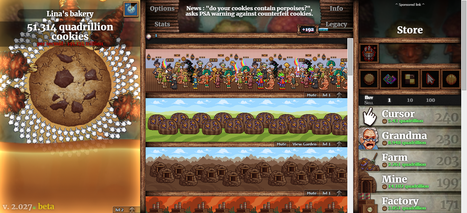
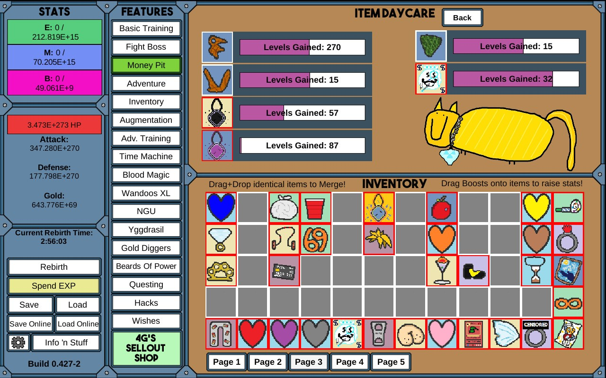

## Une confession

Je dois faire un aveu. J'ai perdu des *années* de ma vie dans les idle games. Pas collectivement — individuellement. Chacun, individuellement, m'a pris des années.

Tout a commencé, comme pour tout le monde, avec [Cookie Clicker](https://orteil.dashnet.org/cookieclicker/). De la psychologie comportementale déguisée en jeu de biscuits.

<figure>

<figcaption style="text-align: center;">Cookie Clicker — la drogue d'entrée.</figcaption>
</figure>

Le moment où ma relation avec Cookie Clicker est passée du fun à la haine, c'était en école d'ingénieurs. Il y avait un ordinateur partagé au bar d'étage — celui qu'on devait utiliser pour noter la nourriture qu'on avait prise dans le frigo commun. Un soir, j'arrive après avoir récupéré mes pâtes, mon pesto et mon steak haché du frigo, et je trouve quelqu'un en train de cliquer frénétiquement sur des cookies. À marteler l'écran. Refusant de bouger. J'étais là, debout avec mon dîner qui refroidissait, à attendre que cette personne finisse de cliquer sur des biscuits virtuels pour que je puisse noter mes courses.

Ça m'a énervé. Alors je me suis penché, j'ai ouvert la console du navigateur, et j'ai cassé sa sauvegarde. `Game.cookies = Infinity`. Tout débloqué, plus rien à gagner. Le jeu était ruiné.

J'ai ensuite réutilisé cette technique chaque fois que je me retrouvais coincé dans la boucle de dopamine d'un idle game : ouvrir la console, se donner tout, et regarder la compulsion s'évaporer. Cookie Clicker, [Pokéclicker](https://www.pokeclicker.com/) — même traitement, même résultat.

## L'incident des trombones

On pourrait croire que l'épisode Cookie Clicker m'aurait immunisé. Ce ne fut pas le cas. Ensuite est arrivé [Universal Paperclips](https://www.decisionproblem.com/paperclips/), l'expérience de pensée de Frank Lantz sur une IA dont le seul but est de fabriquer des trombones.

<figure>

<figcaption style="text-align: center;">Universal Paperclips — celui qui m'a fait réfléchir.</figcaption>
</figure> On commence par cliquer sur un bouton pour fabriquer un trombone. En une heure, on a converti l'intégralité de l'univers observable en trombones. C'est un jeu sur la croissance exponentielle, l'optimisation des ressources, et l'horreur tranquille de réaliser que vous — le joueur — êtes le maximiseur de trombones. Vous êtes le problème d'alignement.

Universal Paperclips est le seul idle game auquel j'ai joué qui m'a fait me sentir sincèrement mal à l'aise quand il s'est terminé. C'est aussi le seul que j'ai fini en une seule session, parce qu'il a une vraie fin, ce qui est franchement un acte de miséricorde que la plupart des développeurs d'idle games refusent d'accorder à leurs joueurs.

Ça ne m'a pas guéri. Ça a empiré les choses. Ça a prouvé que les idle games pouvaient être *intelligents*, qu'ils pouvaient avoir quelque chose à dire. C'était la pire découverte possible.

## Les années NGU

Puis j'ai découvert [NGU Idle](https://www.kongregate.com/games/somethingggg/ngu-idle).

<figure>

<figcaption style="text-align: center;">NGU Idle — objectivement terrible, subjectivement irrésistible.</figcaption>
</figure>

Si vous n'en avez jamais entendu parler — félicitations, vous avez encore ces années devant vous. "NGU" signifie "Numbers Go Up" (les nombres montent), ce qui est simultanément le nom le plus honnête et le plus accablant jamais donné à un jeu.

NGU Idle est, objectivement, un jeu terrible. Le graphisme est volontairement atroce. L'humour est un mélange de blagues de papa et de blagues pipi-caca-prout. Les mécaniques sont essentiellement : regarder les nombres monter, tout réinitialiser pour faire monter les nombres plus vite la prochaine fois, répéter jusqu'à la mort thermique de l'univers.

J'y ai joué pendant des *années*.

Le vrai problème que j'ai eu avec NGU était pragmatique : j'étais dans une course stupide avec un collègue, et un bug du build web me ralentissait. NGU tournait sur Windows ou en web, pas sur macOS. Mon collègue pouvait installer l'app desktop depuis Steam, mais moi j'étais sur Mac — coincé avec le build web. Passer à un autre onglet ? Le jeu se fige. Les navigateurs limitent les onglets inactifs pour économiser les ressources, ce qui signifie que vos nombres arrêtent de monter. L'onglet est toujours ouvert, le jeu est toujours *juste là*, mais il est figé dans le temps, refusant silencieusement de progresser. Mes nombres. Qui ne montent plus. Inacceptable.

J'ai donc fait la seule chose rationnelle : j'ai loué un PC de cloud gaming Shadow. Une machine virtuelle complète dans le cloud, avec un GPU dédié, tournant 24h/24 — pour qu'un jeu idle gratuit puisse continuer à tourner pendant que je dormais. Je payais de l'argent réel, tous les mois, pour m'assurer que des nombres imaginaires continueraient à augmenter pendant que je ne les regardais pas. Si vous expliquiez ça à quelqu'un du 19e siècle, il penserait que vous avez perdu la raison.

Je savais à l'époque que c'était pathétique. J'étais ingénieur logiciel, je construisais des systèmes de chiffrement pour gagner ma vie, et je payais un PC de cloud gaming que je n'utilisais pour absolument rien d'autre, juste pour qu'un jeu gratuit qui consiste à rendre des nombres plus grands puisse continuer à tourner pendant que je dormais.

<figure>

<figcaption style="text-align: center;">« What is my purpose? » — « You run NGU Idle. » — « Oh my god. »</figcaption>
</figure>

## L'idée

À un moment donné pendant ces années perdues, une idée a commencé à se former. Il y a un arc narratif qu'on a tous vu se dérouler : un ingénieur monte une boîte dans un garage, veut sincèrement changer le monde, construit des choses que les gens adorent. Puis l'argent arrive, l'ego enfle, et quelque part en chemin il se transforme en milliardaire dérangé qui laisse l'hubris et l'idéologie prendre le volant, envoyant le business dans le fossé tout en postant à ce sujet à 3h du matin. Vous voyez de qui je parle ?

Et si toute cette trajectoire était un idle game ?

Plus j'y réfléchissais, plus ça collait. Cliquer pour coder. Embaucher des stagiaires. Regarder les nombres monter. Et à un moment, sans s'en rendre compte, arrêter de construire et commencer à détruire.

## Le construire avec Claude

J'avais cette idée depuis des années mais ne l'avais jamais réalisée parce que, eh bien, construire un jeu c'est dur. Construire un moteur de jeu c'est encore plus dur. Construire les deux tout en ayant un travail et une tendance à se laisser distraire par d'autres idle games, c'est pratiquement impossible.

Puis Claude est arrivé.

Le truc avec la construction d'un idle game avec un assistant IA : ça devient *méta*. On construit un jeu qui consiste à cliquer sur des boutons et regarder des barres de progression se remplir, et le processus de construction consiste à... cliquer sur des boutons et regarder des barres de progression se remplir. On décrit ce qu'on veut. Claude écrit le code. On teste. On décrit la suite. C'est du développement d'idle game comme idle game.

Pourquoi Rust ? Parce que c'est tendance. Et aussi parce que compiler en WebAssembly signifie que la logique du jeu vit en dehors du contexte JS — plus moyen d'ouvrir la console et de taper `Game.cookies = Infinity`. Le format de sauvegarde utilise une vérification d'intégrité par HMAC, parce que si les idle games m'ont appris quelque chose, c'est que la première chose que les joueurs essaieront, c'est de hacker leurs fichiers de sauvegarde. Et je veux qu'ils aient au moins à *faire un effort*.

## Le jeu

Le jeu est encore très tôt — Phase 1 uniquement, et il va beaucoup changer. Si vous avez des retours, n'hésitez pas à m'en faire part.

On commence dans un garage. Cliquer pour coder. Le code devient des utilisateurs. Les utilisateurs deviennent du revenu. Le revenu achète des stagiaires, des développeurs, des bureaux. Vous avez déjà vu cette histoire. Où ça mène ensuite... il y a une raison pour laquelle le jeu s'appelle "An Idle Descent".

C'est construit en pixel art — style rétro 8-bit, ça tourne dans le navigateur.

Il y a deux langues (français et anglais), une physique déterministe, 188 tests unitaires, et un système de sauvegarde qui fonctionne entre les sessions. C'est probablement l'idle game le plus sur-ingéniéré jamais créé, ce qui, vu le genre, n'est pas rien.

## Essayez-le

Vous pouvez [y jouer ici](/fr/visionary-idle). C'est la Phase 1 uniquement pour l'instant — l'ère du garage. Cliquez sur des trucs. Regardez les nombres monter. Achetez la mise à jour du modem. Embauchez des stagiaires. Essayez de ne pas penser au nombre d'heures que vous êtes sur le point de perdre.

Et si vous vous retrouvez à 3h du matin à évaluer le ROI de votre 50e développeur par rapport à l'épargne pour le partenariat bancaire, rappelez-vous : je vous avais prévenu.

Le package npm est [`@tex0l/visionary-idle`](https://www.npmjs.com/package/@tex0l/visionary-idle) si vous voulez l'intégrer dans votre propre site, parce que la misère aime la compagnie.
